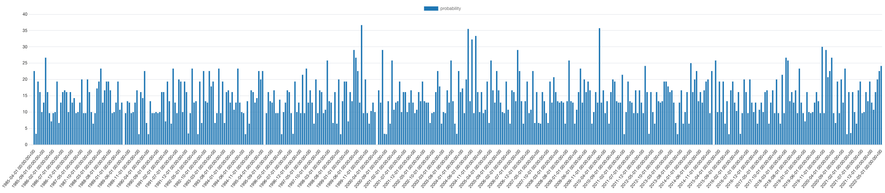

# Carmen Sandiego Analytics

This dbt project builds a dimensional model to analyze sightings of Carmen Sandiego based on regional reports from multiple geographic sources. 
The pipeline ingests raw `.xlsx` files, transforms them into clean, structured data, and produces analytical views that help answer key questions about Ms. Sandiego's whereabouts and behavior.

---

## Questions This Project Answers

The analytical views generated by the dbt models help answer the following questions:

1. **For each month, which agency region is Carmen Sandiego most likely to be found?**  
2. **Also for each month, what is the probability that Ms. Sandiego is armed AND wearing a jacket, but NOT a hat?**
    * What general observations about Ms. Sandiego can you make from this? 
4. **What are the three most occurring behaviors of Ms. Sandiego?**  
5. **For each month, what is the probability Ms. Sandiego exhibits one of her three most occurring behaviors?**

---

## Input Data Handling

The raw data comes in the form of `.xlsx` spreadsheets, with one sheet per geographic region (e.g., Africa, Europe, Pacific). This file is preprocessed into CSV format using Python scripts located in:

- `source/scripts/` – contains Python utilities for:
  - Reading `.xlsx` file and converting it to separate CSVs
  - Mapping column names to a common data dictionary  
- `source/input_data/` – contains the original `.xlsx` file  
- `seeds/` – the output CSVs that dbt uses as seed data

> ⚠️ Note: The column-mapping script currently assumes consistent column order across all `.xlsx` sheets. If the schema of the input changes, the mapping logic should be updated accordingly.

## Requirements

To run this project, ensure you have the following installed or available via Docker:

- **Python** (>= 3.8): for running preprocessing scripts to convert `.xlsx` file to separate `.csv`
- **Docker** & **Docker Compose**: used to containerize and orchestrate the dbt + PostgreSQL environment
- **dbt-core** version `1.5.0`: for building the data models
- **PostgreSQL** version `13`: used as the data warehouse for dbt models

## ⚙How to Run the Project

1. **Start the environment with Docker Compose**  

   This will spin up the PostgreSQL container and dbt environment:
   ```bash
   docker compose up -d --build
   ```
3. **Seed the database with raw data**

   Run this after preprocessing your Excel file into CSVs:
   ```bash
   docker compose run --rm dbt seed
   ```
5. **Build the dbt models**

   Run all models (staging, intermediate, and analytics):
   ```bash
   docker compose run --rm dbt run
   ```
7. **Run the tests**

   Execute all standard and custom dbt tests:
   ```bash
   docker compose run --rm dbt test
   ```
## Entity-Relationship Diagram

The following diagram presents the structure of the analytics schema, showing how dimensional and fact tables relate in this dbt project:

<p align="center">
  
</p>

## Analytical Questions & Views

This project answers four key analytical questions based on Carmen Sandiego sightings. 
Each question is addressed with a dedicated dbt model in the `model/marts/analytics` schema.

---

### a. For each month, which agency region is Carmen Sandiego most likely to be found?

**Model:** `carmen_likely_region`

This model aggregates the number of sightings per region per month and identifies the region with the maximum observations for each month.

**Logic & Steps:**

1. **Aggregate sightings by month and region:**  
   Using the `fact_observation` table, we group sightings by month (`date_witness` truncated to month) and `region_id`.  
   We count the total observations for each (month, region) pair.

2. **Rank regions by sightings per month:**  
   For each month, we rank the regions in descending order of their observation counts using `ROW_NUMBER()`.
   This allows us to identify the region with the highest number of sightings each month.

4. **Select top region per month:**  
   We filter to keep only the region with the highest count (`rn = 1`) for each month.

5. **Join to region dimension:**  
   To get human-readable region names, we join the results with `dim_region` on `region_id`.

6. **Order results by month:**  
   The final output lists, for each month, the most likely region where Carmen Sandiego was sighted.

**Observation:**  
When aggregating across all months, we observe that Carmen Sandiego is most often found in:

- **Europe**: 2,030 sightings  
- **America**: 1,684 sightings  
- **Asia**: 1,461 sightings  
- **Africa**: 9 sightings  

These findings suggest that Europe may be her primary base of operations.

---

### b. For each month, what is the probability that Ms. Sandiego is armed AND wearing a jacket, but NOT a hat?

**Model:** `carmen_general_obs`

This model calculates the probability of sightings where Ms. Sandiego is:

- Armed (`has_weapon = true`)
- Wearing a jacket (`has_jacket = true`)
- Not wearing a hat (`has_hat = false`)

for each month.

**Logic & Steps:**

1. **Aggregate sightings by month:**  
   We group all sightings by month (`date_witness` truncated to month).

2. **Count total sightings per month:**  
   Calculate the total number of observations for each month.

3. **Count sightings matching condition:**  
   Count the number of sightings per month where Ms. Sandiego is armed (`has_weapon = TRUE`), wearing a jacket (`has_jacket = TRUE`), and **not** wearing a hat (`has_hat = FALSE`).

4. **Calculate probability:**  
   Compute the probability (percentage) of sightings meeting the condition by dividing the count of condition observations by total observations per month.

$$
\text{Probability} = \frac{\text{Conditional Observations}}{\text{Total Observations}}
$$

**Observations:**

1. **Generally low probability** — Ms. Sandiego rarely appears armed and jacketed without a hat, though notable spikes exist.
2. **Notable months with >10% probability** include:
   - May 2000 — **16.13%**
   - February 2004 — **13.79%**
   - June 1986 / 1995 / 2018 — **13.33%**
   - Multiple months in late fall/winter and early spring such as January 1989, December 1986, February 2004 and 2013, and March 2021 — **~12.64%**

3. **Seasonal trend detected**: Spikes are more frequent during **cooler months** (fall and winter), suggesting environmental influence on dress and arming.
4. The **"no hat" condition is restrictive**, indicating she often combines jackets with hats — possibly for masking or warmth.
5. Months with spikes may correspond to **special operations** or notable events, specifially related to enviromental conditions.

This pattern suggests tactical planning by Ms. Sandiego and adaptability based on climate and context.

### c. What are the three most occurring behaviors of Ms. Sandiego?

**Model:** `carmen_top_behaviors`

This model identifies the most frequently observed behaviors of Ms. Sandiego across all sightings in the dataset.

**Logic & Steps:**

1. **Filter behaviors:**  
   Select all non-null behavior entries from the sightings dataset.

2. **Count occurrences:**  
   Aggregate the number of times each behavior appears.

3. **Order and limit:**  
   Sort behaviors by descending occurrence count and limit to the top three.

**Top 3 behaviors:**

<div align="center">

| Behavior         | Count |
|------------------|-------|
| out-of-control   | 637   |
| complaining      | 636   |
| happy            | 635   |

</div>

### d. 📅 For each month, what is the probability Ms. Sandiego exhibits one of her three most occurring behaviors?

**Model:** `carmen_top_behaviors_prob`

This model calculates the monthly probability that Ms. Sandiego exhibits any of her three most frequent behaviors: *out-of-control*, *complaining*, or *happy*.

**Logic & Steps:**

1. **Identify top behaviors:**  
   Reference the top three behaviors identified in the `carmen_top_behaviors` model.

2. **Count total sightings per month:**  
   Calculate the total number sightings per month.
   
3. **Count monthly observations of top behavior:**  
   Count sightings where behavior matches any of the top three.

4. **Calculate probability:**  
   Compute the monthly probability as the ratio of top behavior sightings to total sightings, expressed as a percentage.

$$
\text{Probability} = \frac{\text{Top 3 Behaviors}}{\text{Total Observations}}
$$

**Observations:**

1. The monthly probabilities range widely, from 0% (e.g., April 1985 and 1989, June 1995) up to approximately 36.7% (September 1999), showing that while these behaviors are common, they do not dominate every month, suggesting that her actions may be influenced by seasonal factors or specific events in certain months.
2. The average monthly probability across the dataset is approximately 14.02%, indicating that on average, these dominant behaviors appear in roughly one out of every seven sightings.

<p align="center">
  
</p>
